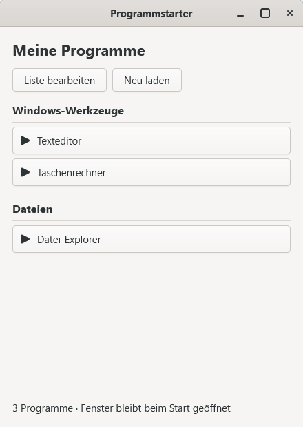

# GTK-Programmstarter

Ein kleiner Programmstarter für Windows, geschrieben in C17 mit GTK 4. Er liest eine einfache Textdatei, zeigt die Programme nach Gruppen an und startet sie ohne zusätzliches Konsolenfenster.

## Was kann der Programmstarter?

- Programme aus einer frei bearbeitbaren Textdatei anzeigen
- Einträge mit eigenen Namen und Windows-Pfaden anlegen
- Programme in Gruppen wie Werkzeuge, Dateien oder Entwicklung ordnen
- Programme per Schaltfläche starten
- Die Liste bearbeiten und anschließend ohne Neustart neu laden
- Das Hauptfenster geöffnet lassen, während gestartete Programme weiterlaufen
- UTF-8, Umlaute, Leerzeichen und Windows-Umgebungsvariablen verarbeiten

## Schnellstart unter Windows

Der Programmstarter wird aus dem Quellcode mit Visual Studio und GTK 4 gebaut.

1. Dieses Repository klonen oder als ZIP herunterladen.
2. <code>Programmstarter.slnx</code> in Visual Studio öffnen.
3. Als Konfiguration <code>Release</code> oder <code>Debug</code> und als Plattform <code>x64</code> wählen.
4. **Erstellen → Projektmappe erstellen** ausführen.
5. Die erzeugte <code>Programmstarter.exe</code> aus dem Ausgabeordner starten.

Das Projekt ist auf GTK 4 über vcpkg mit dem Triplet <code>x64-windows</code> vorbereitet. Standardmäßig wird <code>C:\vcpkg</code> verwendet. Liegt vcpkg an einem anderen Ort, muss im Projekt die Eigenschaft <code>VcpkgRoot</code> mit abschließendem Backslash angepasst werden.

Beim Bauen werden die benötigten GTK-DLLs und GSettings-Schemas neben die EXE kopiert. Für eine Weitergabe immer den vollständigen Ausgabeordner kopieren, nicht nur die EXE.

## Die Programmliste programme.txt

Beim Start sucht das Programm die Datei <code>programme.txt</code> im selben Ordner wie die gestartete EXE. Für einen Release-Build liegt sie normalerweise unter <code>bin\\Release\\programme.txt</code>, für einen Debug-Build unter <code>bin\\Debug\\programme.txt</code>.

Falls sie dort noch nicht vorhanden ist, die Datei nach dem Beispiel unten anlegen. Ein Beispiel:

~~~text
[Werkzeuge]
Texteditor | %WINDIR%\\System32\\notepad.exe
Taschenrechner | %WINDIR%\\System32\\calc.exe

[Entwicklung]
Visual Studio | devenv.exe
Mein Programm | C:\\MeineProgramme\\MeinProgramm.exe

# Diese Zeile ist ein Kommentar
; Auch diese Zeile wird ignoriert
~~~

Die Regeln sind:

- Eine Gruppe steht allein in eckigen Klammern, zum Beispiel <code>[Werkzeuge]</code>.
- Ein Programm steht als <code>Anzeigename | Pfad</code> in einer Zeile.
- Leerzeilen sowie Zeilen mit <code>#</code> oder <code>;</code> werden ignoriert.
- Leerzeichen und Umlaute sind erlaubt.
- Anführungszeichen um den Pfad sind optional.
- Relative Pfade beziehen sich auf den Ordner der Programmstarter-EXE.
- Variablen wie <code>%WINDIR%</code> und <code>%LOCALAPPDATA%</code> werden aufgelöst.
- Das Zeichen <code>|</code> darf nicht im Pfad vorkommen.
- Startparameter hinter dem EXE-Pfad sind in dieser Version nicht vorgesehen.
- Die Datei sollte als UTF-8 gespeichert werden. UTF-8 mit BOM wird ebenfalls akzeptiert.

Die Datei im Projektordner dient als Vorlage. Eine bereits vorhandene Datei im Ausgabeordner wird beim Neubauen nicht automatisch überschrieben.

## Liste bearbeiten und neu laden

1. Den Programmstarter starten.
2. **Liste bearbeiten** anklicken. Die aktive <code>programme.txt</code> wird im zugeordneten Texteditor geöffnet.
3. Einträge ändern, hinzufügen oder löschen.
4. Die Datei speichern.
5. Im Programmstarter **Neu laden** anklicken.

Die sichtbare Liste wird erst nach dem erfolgreichen Neuladen ersetzt. Wenn die neue Datei nicht gelesen werden kann oder einen Formatfehler enthält, bleibt die vorherige funktionierende Liste erhalten.

Jede Programmschaltfläche startet den eingetragenen Pfad. Das Arbeitsverzeichnis des gestarteten Programms ist dessen eigener Ordner. Bei einem Startfehler erscheint die Ursache unten im Fenster. Ein gestartetes Konsolenprogramm darf sein eigenes Konsolenfenster öffnen; der Programmstarter selbst läuft ohne Konsole.

## Typische Fehler

**<code>programme.txt</code> wird nicht gefunden**

Die Datei muss neben der tatsächlich gestarteten <code>Programmstarter.exe</code> liegen. Bei Visual Studio ist das meistens der jeweilige <code>bin\\Debug</code>- oder <code>bin\\Release</code>-Ordner.

**Ein Programm startet nicht**

Den Pfad in <code>programme.txt</code> prüfen. Bei relativen Pfaden vom EXE-Ordner ausgehen. Für einen ersten Test einen vollständigen Pfad oder <code>%WINDIR%\\System32\\notepad.exe</code> verwenden.

**Nach einer Änderung ist die alte Liste sichtbar**

Die Datei speichern und danach **Neu laden** anklicken. Ein Neustart ist dafür nicht notwendig.

**GTK-DLL fehlt**

Nicht nur die EXE kopieren. Den vollständigen Ausgabeordner mit DLLs und dem Ordner <code>share\\glib-2.0\\schemas</code> verwenden.

## Technischer Aufbau

- <code>programmstarter.c</code> enthält Parser, GTK-Oberfläche und Programmstart.
- <code>wWinMain</code> verwendet das Windows-Subsystem, damit kein zusätzliches Konsolenfenster erscheint.
- <code>ShellExecuteExW</code> startet Programme unabhängig vom Programmstarter.
- Die Pfade werden ohne Kommandozeileninterpreter gestartet.

## Projektdateien

- <code>Programmstarter.slnx</code> – Visual-Studio-Projektmappe
- <code>Programmstarter.vcxproj</code> – Projekt- und vcpkg-Konfiguration
- <code>programmstarter.c</code> – Quellcode
- <code>Vorschau.png</code> – Bildschirmansicht
- <code>programme.txt</code> – lokale Konfigurationsdatei neben der EXE (nicht Bestandteil des Repositorys)

Eigene Pfade in <code>programme.txt</code> sind immer rechnerabhängig. Vor einer Weitergabe muss die Liste daher an den Zielrechner angepasst werden.

## Lizenz und Nutzung

Dieses Repository ist ein persönliches Lern- und Praxisprojekt. Vor einer Weitergabe bitte die vorhandene GTK-4-Lizenzierung und die verwendeten Abhängigkeiten beachten.
